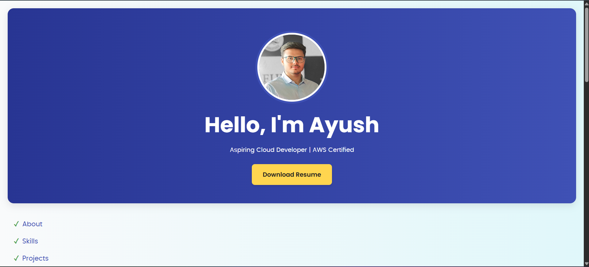

# 💼 Ayush Dubey Portfolio

This is my personal portfolio website that highlights my skills, projects, and contact information in a responsive, clean layout.

---

## 🔧 Features

- Responsive design built using **HTML**, **CSS**, and **JavaScript**
- Showcases skills in **AWS** and **Cloud Technologies**
- Interactive sections: About, Skills, Projects, Education, and Contact
- Easy navigation with internal links and clear UI
- Linked to GitHub and LinkedIn profiles

---

## 🛠️ Technologies Used

- **HTML5**, **CSS3**, **JavaScript**
- **Git** & **GitHub** for version control

---

## 📸 Screenshot

---

## 📬 Contact

- 📧 Email: [ayushdubey0806@gmail.com](mailto:ayushdubey0806@gmail.com)  
- 🔗 LinkedIn: [linkedin.com/in/ayush-dubey66](https://www.linkedin.com/in/ayush-dubey66/)  
- 💻 GitHub: [github.com/ayushdubey025](https://github.com/ayushdubey025)

---

## 🚀 Hosting

This portfolio will be hosted on **AWS** using:
- Amazon **S3** (Static site hosting)
- **CloudFront** (CDN & HTTPS)
- **ACM** (Free SSL)
- *(Optional)* Route 53 for custom domain  
👉 [Hosted Repo Link](https://github.com/ayushdubey025/aws-static-portfolio)

---

## 🤝 Feel Free to Connect!

I’m open to collaboration, cloud projects, and job opportunities. Let’s connect and build something great!
